# Field Info Agent - 业务逻辑图

> 本文档详细描述了Field Info Agent的完整业务逻辑和流程

---

## 一、整体业务架构图

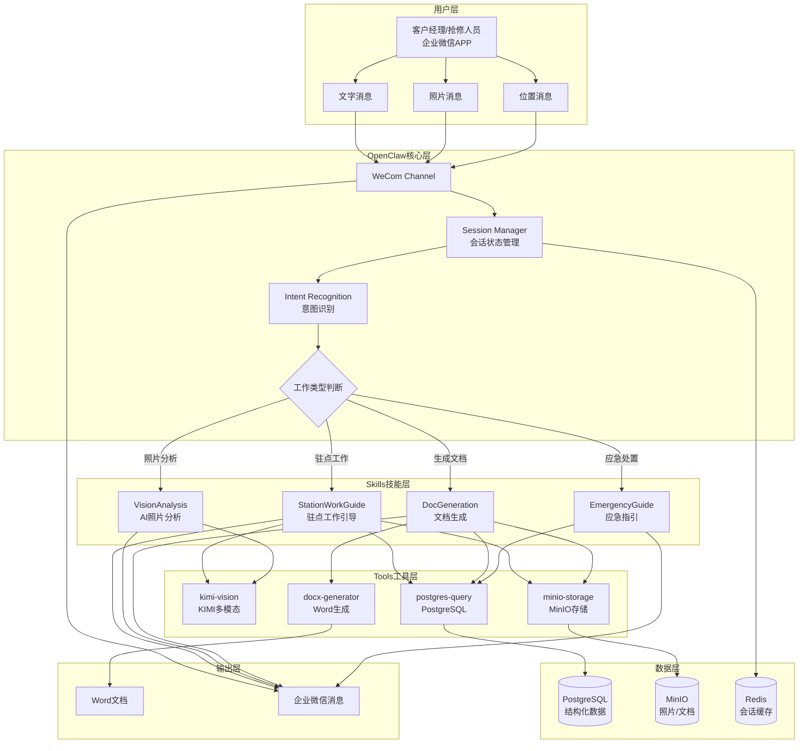

---

## 二、核心业务流程图

### 2.1 驻点工作全流程

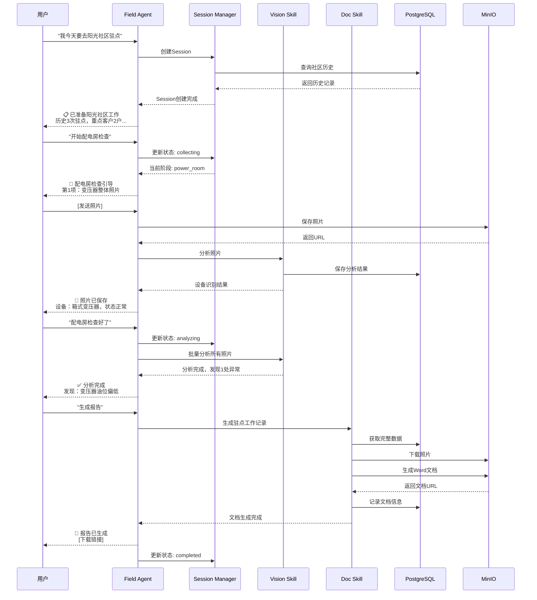

---

## 三、状态流转图

### 3.1 Session状态机

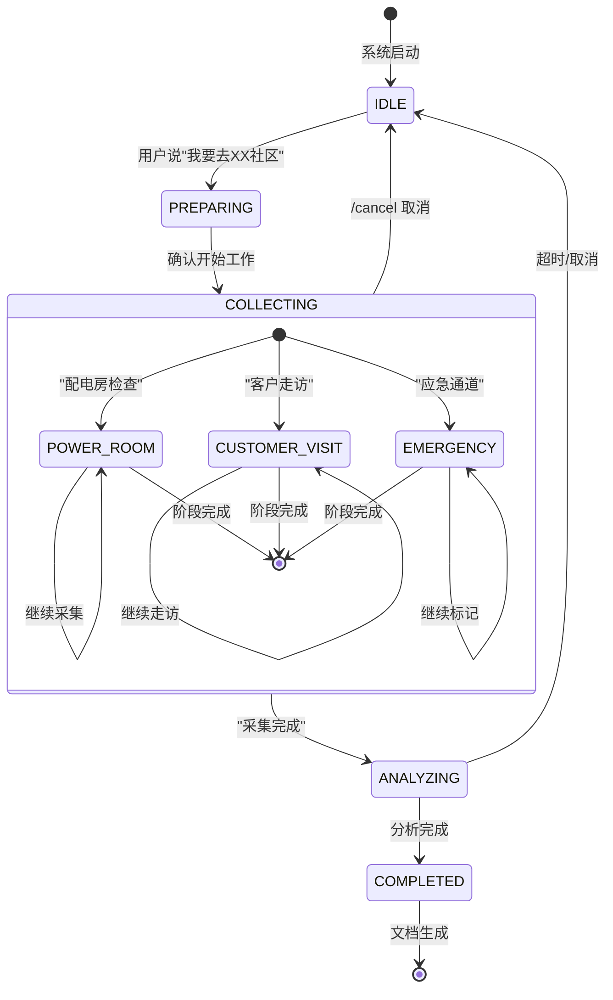

---

## 四、技能详细流程

### 4.1 StationWorkGuide - 驻点工作引导

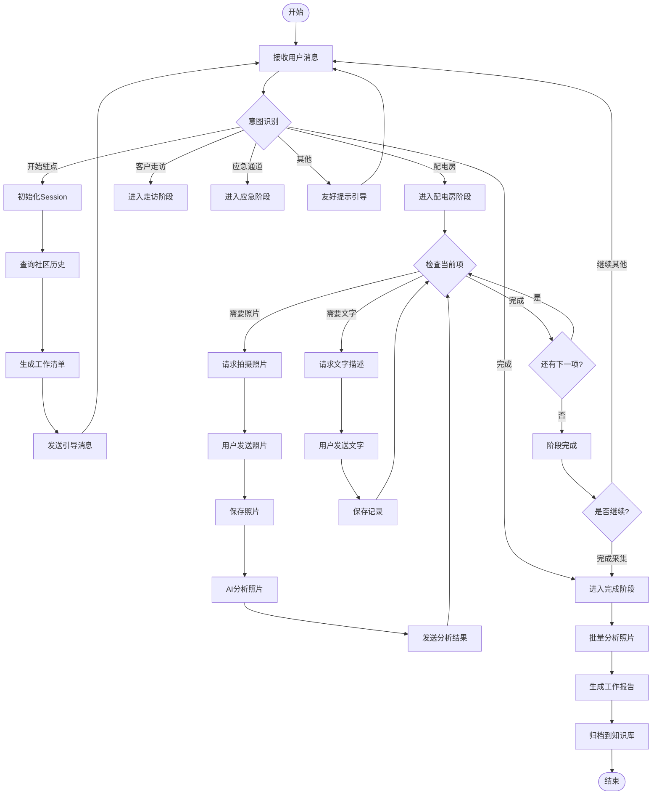

### 4.2 VisionAnalysis - 照片AI分析

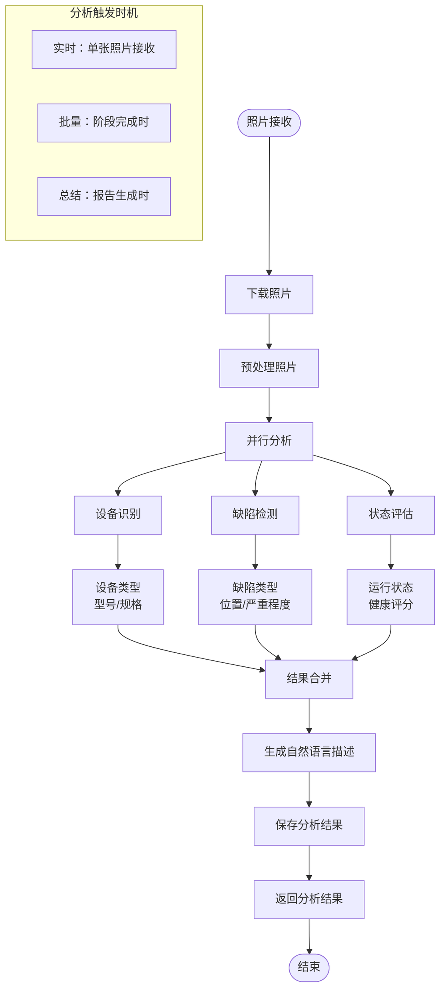

### 4.3 DocGeneration - 文档生成

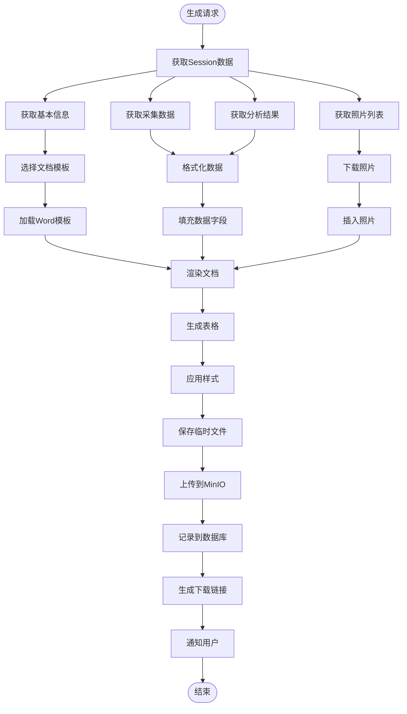

### 4.4 EmergencyGuide - 应急处置

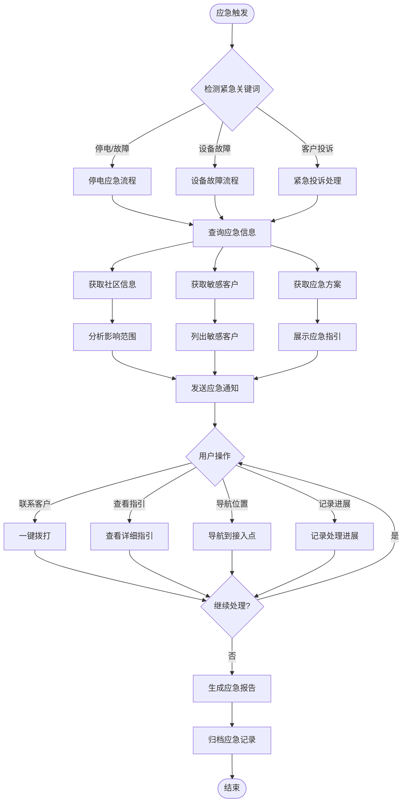

---

## 五、数据流转图

### 5.1 数据存储架构

```mermaid
graph TB
    subgraph 用户输入
        A1[文字消息]
        A2[照片]
        A3[位置信息]
    end

    subgraph OpenClaw处理
        B[Channel Handler] --> C[Session Manager]
        C --> D[Skills处理]
    end

    subgraph 数据分类存储
        D -->|结构化数据| E1[PostgreSQL]
        D -->|非结构化数据| E2[MinIO]
        D -->|会话状态| E3[Redis]
    end

    subgraph PostgreSQL表
        E1 --> F1[field_sessions<br/>会话表]
        E1 --> F2[field_collections<br/>采集记录表]
        E1 --> F3[photo_analysis<br/>照片分析表]
        E1 --> F4[generated_documents<br/>生成文档表]
        E1 --> F5[community_info<br/>社区信息表]
    end

    subgraph MinIO存储
        E2 --> G1[/photos/<br/>照片存储/]
        E2 --> G2[/documents/<br/>Word文档/]
        E2 --> G3[/templates/<br/>文档模板/]
    end

    subgraph Redis缓存
        E3 --> H1[session:{userId}<br/>活跃会话]
        E3 --> H2[lock:{userId}<br/>并发锁]
    end

    subgraph 数据输出
        F2 --> I[工作记录]
        F4 --> I
        G2 --> I
    end
```

### 5.2 照片处理数据流

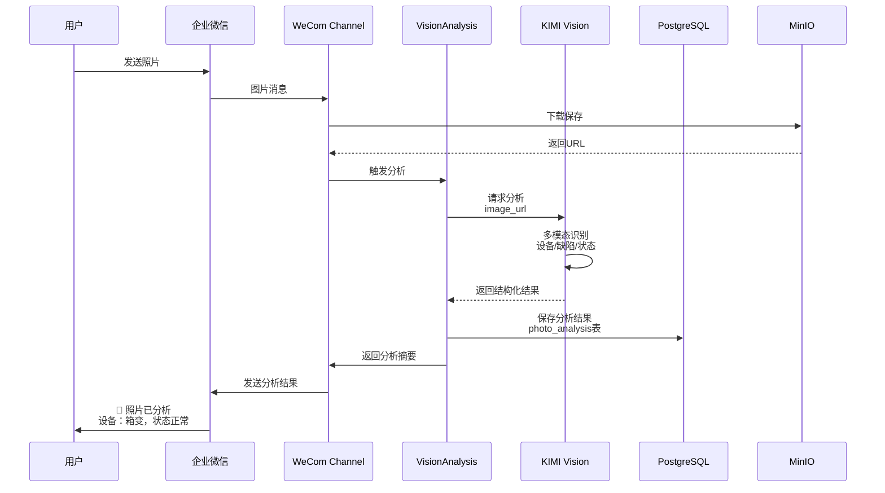

---

## 六、集成架构图

### 6.1 系统整体集成

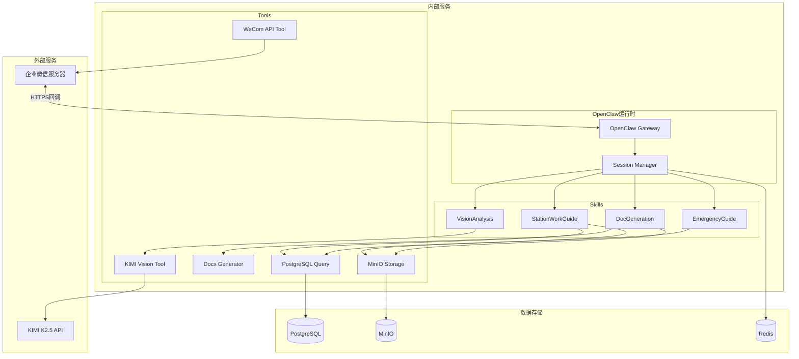

---

## 七、业务场景流程

### 7.1 场景1：完整的驻点工作流程

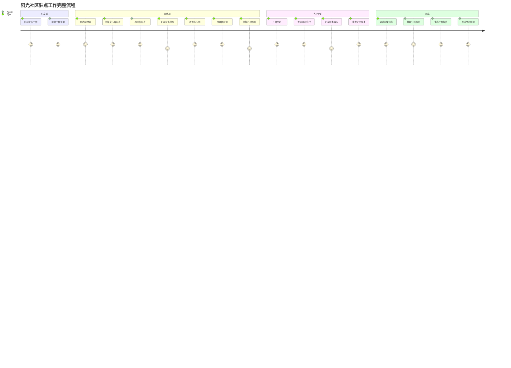

### 7.2 场景2：应急处置流程

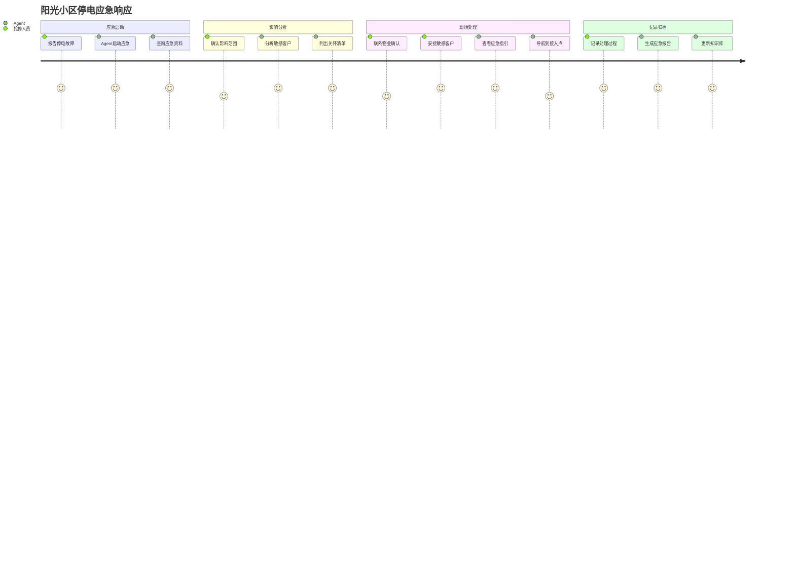

---

## 八、关键决策点

### 8.1 技术决策

| 决策点 | 选择方案 | 决策理由 |
|--------|----------|----------|
| **语音输入** | 仅文字输入 | 用户使用语音输入法转文字 |
| **图像识别** | KIMI 2.5多模态 | 国产模型，理解能力强，合规性好 |
| **文档存储** | 本地MinIO | 数据主权，完全自主控制 |
| **数据存储** | PostgreSQL | 结构化数据，版本化管理 |
| **会话管理** | Redis | 高性能，支持过期自动清理 |

### 8.2 业务决策

| 决策点 | 选择方案 | 决策理由 |
|--------|----------|----------|
| **交互方式** | 自然语言（零命令） | 降低学习成本，提高接受度 |
| **照片分析** | 实时+批量结合 | 采集时简单确认，完成后深度分析 |
| **文档生成** | 自动+手动触发 | 阶段完成自动生成，支持随时生成 |
| **数据版本** | 全版本化 | 支持历史追溯，永不丢失 |

---

## 九、异常处理流程

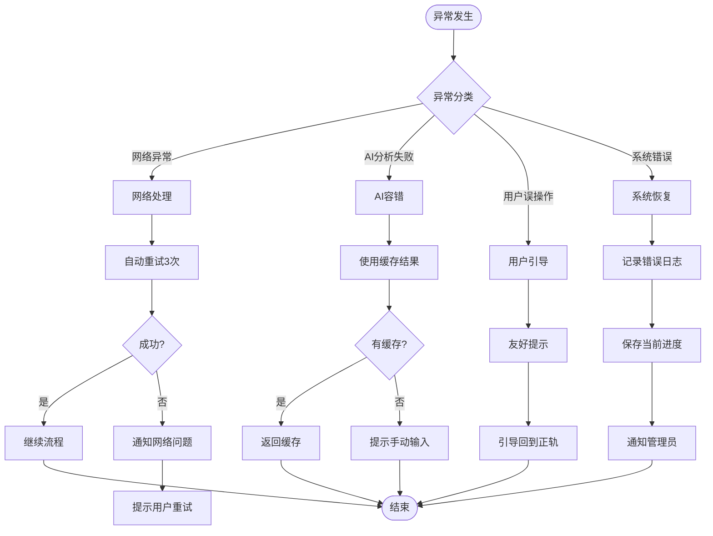

---

**文档版本**: 1.0.0  
**最后更新**: 2026-03-18  
**作者**: PM Agent
