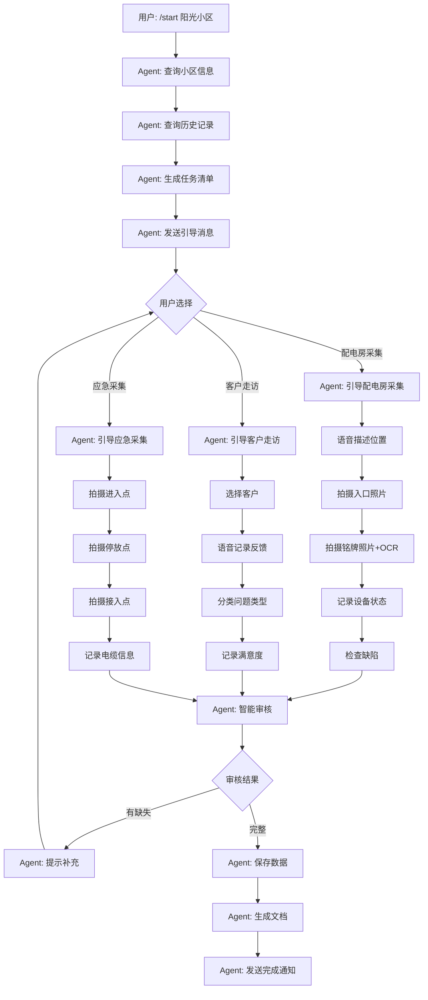

# 现场信息收集Agent - 详细设计方案

---

date: 2026-03-17
version: 2.0
design_type: 技术实现方案
status: 详细设计

---

## 一、设计概述

### 1.1 设计目标

基于技术可行性分析结论，设计一套**技术上可行、业务上可用、实施上可控**的解决方案。

### 1.2 设计原则

```yaml
原则1: 尊重技术边界
  - 不试图突破企业微信的限制
  - 采用混合触发策略
  
原则2: 渐进式实现
  - MVP优先，快速验证
  - 迭代优化，持续交付
  
原则3: 异常容错
  - 每个环节都有备选方案
  - 用户可随时人工介入
  
原则4: 用户体验优先
  - 语音为主，减少操作
  - 实时反馈，告知进度
```

### 1.3 技术架构确认

```
┌──────────────────────────────────────────────────────────────┐
│                         用户层                                │
│              企业微信APP（语音/拍照/文字）                     │
└────────────────────────────┬─────────────────────────────────┘
                             │ HTTPS回调
┌────────────────────────────▼─────────────────────────────────┐
│                   OpenClaw Gateway                           │
│  ┌──────────────┐ ┌──────────────┐ ┌──────────────────────┐  │
│  │ WeCom Channel│ │Session Manager│ │     Skills          │  │
│  └──────────────┘ └──────────────┘ └──────────────────────┘  │
│  ┌─────────────────────────────────────────────────────────┐ │
│  │ Tools: WPS API | Baidu STT | PaddleOCR | WeCom API     │ │
│  └─────────────────────────────────────────────────────────┘ │
└────────────────────────────┬─────────────────────────────────┘
                             │ REST API
┌────────────────────────────▼─────────────────────────────────┐
│                      外部服务层                              │
│       百度语音        WPS开放平台       企业微信服务器        │
└──────────────────────────────────────────────────────────────┘
```

---

## 二、企业微信集成方案

### 2.1 应用类型选择

**选择：自建应用（内部应用）+ 群机器人（辅助）**

#### 2.1.1 自建应用配置

```yaml
应用名称: 现场信息采集助手
应用类型: 内部应用
可见范围: 供电所全员（需在企业微信后台配置）

功能定位:
  - 一对一驻点工作引导
  - 接收语音、照片、位置
  - 生成文档并推送
  
权限申请:
  - 接收消息
  - 发送应用消息
  - 上传素材
  - 获取用户信息
  
回调配置:
  url: https://your-domain.com/webhook/wecom
  token: ${WECOM_TOKEN}
  encoding_aes_key: ${WECOM_AES_KEY}
```

#### 2.1.2 群机器人配置

```yaml
机器人名称: 电小二通知助手
创建位置: 供电所工作群

用途:
  - 日报/周报推送
  - 停电通知
  - 重要问题提醒
  - 工作汇总

Webhook URL: 
  https://qyapi.weixin.qq.com/cgi-bin/webhook/send?key=xxx

消息格式:
  - Markdown（支持图文混排）
  - 文本消息
  - 图文卡片（重要通知）
```

### 2.2 消息交互设计

#### 2.2.1 命令体系

| 命令 | 功能 | 示例 | 权限 |
|------|------|------|------|
| `/start {小区名}` | 启动驻点工作 | `/start 阳光小区` | 客户经理 |
| `/collect {类型}` | 开始采集 | `/collect power-room` | 客户经理 |
| `/status` | 查看当前状态 | `/status` | 全员 |
| `/generate {类型}` | 生成文档 | `/generate briefing` | 客户经理 |
| `/emergency {类型} {地点}` | 应急处置 | `/emergency outage 阳光小区` | 抢修人员 |
| `/query {内容}` | 查询信息 | `/query 阳光小区配电房` | 全员 |
| `/help` | 查看帮助 | `/help` | 全员 |
| `/cancel` | 取消当前任务 | `/cancel` | 客户经理 |

#### 2.2.2 自然语言交互

除命令外，支持自然语言交互：

```
用户: "我要开始阳光小区的驻点工作"
Agent: 识别意图 → 启动驻点工作 → 等同于 /start 阳光小区

用户: "帮我查一下锦绣花园的应急接入点"
Agent: 识别意图 → 查询信息 → 等同于 /query 锦绣花园应急接入点

用户: "生成一份供电简报"
Agent: 识别意图 → 生成文档 → 等同于 /generate briefing
```

**实现方式**：使用NLP意图识别（LLM或规则引擎）

#### 2.2.3 消息类型处理

```yaml
文本消息:
  - 解析命令
  - NLP意图识别
  - 自然语言回复

语音消息:
  - 下载AMR文件
  - 百度语音识别转文字
  - 按文本处理
  - 保存原始语音备查

图片消息:
  - 下载图片文件
  - 根据Session状态决定处理方式
    * 驻点采集中 → OCR识别/存档
    * 其他状态 → 提示"请先开始驻点工作"
  - 上传到WPS云文档

位置信息:
  - 提取GPS坐标
  - 关联到当前小区/配电房
  - 验证位置合理性

文件消息:
  - 提示"暂不支持文件上传"
  - 引导使用照片功能
```

### 2.3 Session状态管理

#### 2.3.1 状态流转图

```
                    ┌──────────┐
         ┌─────────│   IDLE   │◄─────────┐
         │         └────┬─────┘          │
         │              │                │
   /cancel│         /start           完成/取消
         │              │                │
         │              ▼                │
         │         ┌──────────┐          │
         │         │PREPARING │          │
         │         └────┬─────┘          │
         │              │                │
         │              ▼                │
         │    ┌───────────────────┐      │
         └───►│    COLLECTING     │──────┘
              │  (信息采集阶段)    │
              └─────────┬─────────┘
                        │
                        │ 采集完成
                        ▼
              ┌───────────────────┐
              │    CONFIRMING     │
              │  (确认审核阶段)    │
              └─────────┬─────────┘
                        │
                        │ 确认
                        ▼
              ┌───────────────────┐
              │    GENERATING     │
              │  (文档生成阶段)    │
              └─────────┬─────────┘
                        │
                        │ 完成
                        ▼
              ┌───────────────────┐
              │    COMPLETED      │
              └───────────────────┘
```

#### 2.3.2 Session数据结构

```typescript
interface Session {
  // 基础信息
  sessionId: string;
  userId: string;           // 企业微信UserID
  userName: string;         // 用户姓名
  powerStationId: string;   // 所属供电所ID
  
  // 状态信息
  state: 'idle' | 'preparing' | 'collecting' | 'confirming' | 'generating' | 'completed';
  currentTask: string;      // 当前任务类型
  currentPhase: string;     // 当前阶段
  
  // 工作信息
  communityId: string;      // 当前小区ID
  communityName: string;    // 小区名称
  workDate: Date;           // 工作日期
  
  // 采集数据（临时存储）
  collectedData: {
    powerRoom?: PowerRoomData;
    customerVisits?: CustomerVisitData[];
    emergencyInfo?: EmergencyInfoData;
    photos: PhotoData[];
  };
  
  // 进度追踪
  progress: {
    totalSteps: number;
    completedSteps: number;
    currentStep: string;
  };
  
  // 时间戳
  createdAt: Date;
  lastActivity: Date;
  expiresAt: Date;          // Session过期时间
}
```

#### 2.3.3 Session持久化

```yaml
存储方案: Redis
TTL: 3600秒（1小时无操作自动过期）

Key设计:
  session:{userId} → Session数据
  session:{userId}:lock → 并发控制锁

过期处理:
  - Redis自动过期
  - 过期前5分钟提醒用户
  - 用户回复后重置TTL
```

---

## 三、WPS开放平台集成方案

### 3.1 账户与权限

#### 3.1.1 账户准备

```yaml
账号申请:
  - 访问 https://open.wps.cn
  - 注册企业开发者账号
  - 完成企业认证

应用创建:
  - 创建应用 "供电所信息管理系统"
  - 申请API权限:
    * 多维表格API（读写）
    * 云文档API（读写、分享）
    * 文件管理API

获取凭证:
  app_id: ${WPS_APP_ID}
  app_secret: ${WPS_APP_SECRET}
```

#### 3.1.2 权限配置

```yaml
API权限清单:
  ✅ ksheet:read    # 查询多维表格
  ✅ ksheet:write   # 写入多维表格
  ✅ doc:read       # 读取文档
  ✅ doc:write      # 创建/编辑文档
  ✅ file:read      # 读取文件
  ✅ file:write     # 上传文件
  ✅ share:create   # 创建分享链接
```

### 3.2 数据表设计

#### 3.2.1 表结构详细设计

```yaml
# 表1: 供电所配置表
table: station_config
file_id: file_stations_001
sheet_id: sheet_main
columns:
  - station_id: string (主键, 唯一标识)
  - station_name: string (供电所名称)
  - wecom_corp_id: string (企业微信CorpID)
  - wecom_agent_id: string (企业微信应用ID)
  - wps_root_folder_id: string (WPS根文件夹ID)
  - work_group_chat_id: string (工作群ID)
  - supervisor_user_id: string (所长企业微信ID)
  - created_at: datetime
  - updated_at: datetime

# 表2: 小区信息表
table: community_info
file_id: file_communities_001
sheet_id: sheet_main
columns:
  - community_id: string (主键)
  - station_id: string (外键，供电所ID)
  - community_name: string (小区名称)
  - address: string (详细地址)
  - total_households: number (总户数)
  - power_room_count: number (配电房数量)
  - transformer_count: number (变压器数量)
  - property_company: string (物业公司)
  - property_contact: string (物业联系人)
  - property_phone: string (物业电话)
  - sensitive_customer_count: number (敏感客户数)
  - last_station_date: date (上次驻点日期)
  - station_count: number (累计驻点次数)
  - wps_folder_id: string (WPS文件夹ID)
  - created_at: datetime
  - updated_at: datetime

# 表3: 驻点工作记录表
table: station_work_records
file_id: file_station_records_001
sheet_id: sheet_main
columns:
  - record_id: string (主键)
  - station_id: string (外键)
  - community_id: string (外键)
  - work_date: date (驻点日期)
  - worker_user_id: string (客户经理UserID)
  - worker_name: string (客户经理姓名)
  - work_summary: text (工作内容摘要)
  - power_room_checked: boolean (是否检查配电房)
  - customer_visit_count: number (走访客户数)
  - issue_found_count: number (发现问题数)
  - issue_resolved_count: number (解决问题数)
  - photo_count: number (照片数量)
  - status: enum [进行中, 已完成, 已审核]
  - related_doc_urls: array[string] (关联文档链接)
  - created_at: datetime
  - updated_at: datetime

# 表4: 配电房信息表
table: power_room_info
file_id: file_power_rooms_001
sheet_id: sheet_main
columns:
  - room_id: string (主键)
  - station_id: string (外键)
  - community_id: string (外键)
  - room_name: string (配电房名称)
  - location_description: text (位置描述)
  - photo_urls: array[string] (照片URL列表)
  - transformer_count: number (变压器数量)
  - equipment_status: enum [正常, 异常, 检修中]
  - defect_description: text (缺陷描述)
  - last_check_date: date (上次检查日期)
  - check_records: json (检查记录)
  - created_at: datetime
  - updated_at: datetime

# 表5: 变压器信息表
table: transformer_info
file_id: file_transformers_001
sheet_id: sheet_main
columns:
  - transformer_id: string (主键)
  - room_id: string (外键，配电房ID)
  - station_id: string (外键)
  - model: string (型号)
  - capacity: number (容量kVA)
  - manufacturer: string (制造商)
  - install_date: date (投运日期)
  - photo_urls: array[string] (照片)
  - status: enum [正常, 异常, 停运]
  - last_maintenance_date: date (上次检修日期)
  - created_at: datetime
  - updated_at: datetime

# 表6: 应急接入信息表
table: emergency_access_info
file_id: file_emergency_001
sheet_id: sheet_main
columns:
  - community_id: string (主键)
  - station_id: string (外键)
  - entry_point_description: text (进入点描述)
  - entry_point_photos: array[string] (进入点照片)
  - parking_point_description: text (停放点描述)
  - parking_point_photos: array[string] (停放点照片)
  - access_point_description: text (接入点描述)
  - access_point_photos: array[string] (接入点照片)
  - cable_model: string (电缆型号)
  - cable_length: number (电缆长度米)
  - access_conditions: text (接入条件)
  - emergency_contact: string (应急联系人)
  - emergency_phone: string (应急电话)
  - updated_at: datetime

# 表7: 客户信息表
table: customer_info
file_id: file_customers_001
sheet_id: sheet_main
columns:
  - customer_id: string (主键)
  - community_id: string (外键)
  - station_id: string (外键)
  - address: string (详细地址，如2-3-501)
  - is_sensitive: boolean (是否敏感客户)
  - sensitive_type: enum [独居老人, 孕妇, 婴幼儿, 重病患者, 其他]
  - contact_phone: string (联系电话，加密存储)
  - last_visit_date: date (上次走访日期)
  - complaint_count: number (投诉次数)
  - notes: text (备注)
  - created_at: datetime
  - updated_at: datetime

# 表8: 客户走访记录表
table: customer_visit_records
file_id: file_visit_records_001
sheet_id: sheet_main
columns:
  - visit_id: string (主键)
  - station_id: string (外键)
  - community_id: string (外键)
  - customer_id: string (外键)
  - visit_date: date (走访日期)
  - worker_user_id: string (走访人UserID)
  - worker_name: string (走访人姓名)
  - visit_content: text (走访内容)
  - issue_type: enum [无, 停电, 电费, 服务, 其他]
  - issue_description: text (问题描述)
  - resolution: text (处理措施)
  - satisfaction: enum [非常满意, 满意, 一般, 不满意]
  - need_follow_up: boolean (需回访)
  - follow_up_date: date (计划回访日期)
  - photo_urls: array[string] (现场照片)
  - created_at: datetime

# 表9: 设备缺陷记录表
table: equipment_defect_records
file_id: file_defects_001
sheet_id: sheet_main
columns:
  - defect_id: string (主键)
  - station_id: string (外键)
  - room_id: string (外键，配电房)
  - transformer_id: string (外键，可选)
  - defect_type: enum [设备老化, 线路损坏, 环境因素, 安全隐患, 其他]
  - severity: enum [紧急, 重要, 一般]
  - description: text (详细描述)
  - photo_urls: array[string] (照片)
  - discovered_date: date (发现日期)
  - discovered_by: string (发现人)
  - status: enum [待处理, 处理中, 已解决, 已关闭]
  - resolution: text (处理结果)
  - resolved_date: date (解决日期)
  - created_at: datetime
  - updated_at: datetime

# 表10: 通知记录表
table: notification_records
file_id: file_notifications_001
sheet_id: sheet_main
columns:
  - notification_id: string (主键)
  - station_id: string (外键)
  - notification_type: string (通知类型)
  - sender: string (发送者)
  - receivers: array[string] (接收人列表)
  - content: text (通知内容)
  - related_record_id: string (关联记录ID)
  - priority: enum [低, 普通, 高, 紧急]
  - status: enum [待发送, 已发送, 失败]
  - read_status: json (阅读状态)
  - created_at: datetime
```

#### 3.2.2 文件ID管理

```yaml
文件ID生成规则:
  格式: file_{表名}_{供电所ID}
  示例: file_communities_武侯供电中心

统一管理:
  - 首次创建时生成
  - 保存到配置表
  - 所有查询自动添加供电所过滤
```

### 3.3 文档存储结构

#### 3.3.1 文件夹结构设计

```
武侯供电中心/ (wps_root_folder_id)
├── 📁 阳光小区/ (community_folder_id)
│   ├── 📄 小区基础信息.docx
│   ├── 📁 供电简报/ (briefings_folder)
│   │   ├── 📄 2026-03-17_供电简报.docx
│   │   └── 📄 2026-02-15_供电简报.docx
│   ├── 📄 应急发电指引.docx
│   ├── 📁 配电房/ (power_rooms_folder)
│   │   ├── 📁 1号配电房/
│   │   │   ├── 📄 信息记录.docx
│   │   │   └── 📁 照片/
│   │   └── 📁 2号配电房/
│   ├── 📁 客户走访/ (visits_folder)
│   │   └── 📄 2026-03-17_走访记录.docx
│   └── 📁 驻点工作/ (work_records_folder)
│       └── 📄 2026-03-17_驻点总结.docx
│
├── 📁 锦绣花园/
├── 📁 金色家园/
└── 📁 模板/ (templates_folder)
    ├── 📄 tpl_power_briefing.docx
    ├── 📄 tpl_emergency_guide.docx
    ├── 📄 tpl_service_report.docx
    └── 📄 tpl_work_summary.docx
```

#### 3.3.2 文档模板设计

**模板1：小区供电简报**

```
封面
├── 小区名称：{{community_name}}
├── 生成日期：{{date}}
├── 生成人：{{worker_name}}
└── 供电所：{{station_name}}

第1章 小区基本信息
├── 小区名称：{{community_name}}
├── 详细地址：{{address}}
├── 总户数：{{total_households}}
├── 配电房数量：{{power_room_count}}
├── 变压器数量：{{transformer_count}}
├── 物业信息：{{property_info}}
└── 敏感客户数：{{sensitive_customer_count}}

第2章 供电设施概况
├── 配电房清单
│   └── 表格：名称、位置、变压器数量、设备状态
├── 变压器清单
│   └── 表格：型号、容量、厂家、投运时间、状态
└── 设施照片
    └── {{photos}}

第3章 客户服务情况
├── 累计走访：{{total_visits}}户
├── 本月走访：{{month_visits}}户
├── 客户满意度：{{satisfaction_rate}}
├── 问题统计
│   └── 图表：问题类型分布
└── 典型案例
    └── {{case_studies}}

第4章 近期工作计划
├── 待处理问题：{{pending_issues}}
├── 建议关注：{{recommendations}}
└── 下次驻点建议：{{next_station_date}}

附件
├── 现场照片
└── 历史记录
```

**模板2：应急发电指引**

```
标题：{{community_name}} 应急发电车接入指引

一、小区位置及入口
├── 小区地址：{{address}}
├── 发电车进入点：{{entry_point_description}}
├── 进入点照片：{{entry_point_photos}}
└── 注意事项：{{entry_notes}}

二、发电车停放点
├── 停放位置：{{parking_point_description}}
├── 停放点照片：{{parking_point_photos}}
├── 场地条件：{{parking_conditions}}
└── 注意事项：{{parking_notes}}

三、接入点位置
├── 接入点描述：{{access_point_description}}
├── 接入点照片：{{access_point_photos}}
├── 接入方式：{{access_method}}
└── 安全注意事项：{{safety_notes}}

四、电缆信息
├── 电缆型号：{{cable_model}}
├── 电缆长度：{{cable_length}}米
├── 备用电缆：{{backup_cable}}
└── 接线方式：{{wiring_method}}

五、物业联系人
├── 联系人：{{property_contact}}
├── 电话：{{property_phone}}
└── 24小时值班：{{duty_info}}

六、安全注意事项
├── 现场安全
├── 操作规范
├── 应急联系
└── 其他说明
```

### 3.4 WPS API调用规范

#### 3.4.1 Token管理

```typescript
class WPSTokenManager {
  private token: string | null = null;
  private expiresAt: number = 0;
  
  async getToken(): Promise<string> {
    // 检查Token是否有效
    if (this.token && Date.now() < this.expiresAt - 60000) {
      return this.token;
    }
    
    // 重新获取Token
    const response = await axios.post(
      'https://openapi.wps.cn/oauth2/token',
      {
        app_id: process.env.WPS_APP_ID,
        app_secret: process.env.WPS_APP_SECRET,
        grant_type: 'client_credentials'
      }
    );
    
    this.token = response.data.access_token;
    this.expiresAt = Date.now() + response.data.expires_in * 1000;
    
    return this.token;
  }
}
```

#### 3.4.2 请求队列（限流处理）

```typescript
class WPSRequestQueue {
  private queue: Array<() => Promise<any>> = [];
  private processing = false;
  private lastRequestTime = 0;
  private minInterval = 600; // 600ms = 100次/分钟
  
  async add<T>(fn: () => Promise<T>): Promise<T> {
    return new Promise((resolve, reject) => {
      this.queue.push(async () => {
        try {
          const result = await fn();
          resolve(result);
        } catch (error) {
          reject(error);
        }
      });
      
      this.process();
    });
  }
  
  private async process() {
    if (this.processing || this.queue.length === 0) return;
    
    this.processing = true;
    
    while (this.queue.length > 0) {
      const now = Date.now();
      const waitTime = this.minInterval - (now - this.lastRequestTime);
      
      if (waitTime > 0) {
        await sleep(waitTime);
      }
      
      const fn = this.queue.shift();
      if (fn) {
        await fn();
        this.lastRequestTime = Date.now();
      }
    }
    
    this.processing = false;
  }
}
```

---

## 四、Skills详细设计

### 4.1 Skill 1: 驻点工作引导（StationWorkGuide）

#### 4.1.1 Skill定义

```yaml
skill_id: station_work_guide
name: 驻点工作引导
description: 引导现场人员完成驻点工作的全流程信息采集
version: 1.0.0
triggers:
  - command: "/start {小区名}"
  - command: "/start-station-work {小区名}"
  - keyword: ["开始驻点", "驻点工作", "开始采集"]
  - intent: "start_station_work"

entry_conditions:
  - 用户已绑定供电所
  - 小区名存在于数据库
  
exit_conditions:
  - 用户确认完成
  - 用户取消
  - Session超时
```

#### 4.1.2 工作流程



#### 4.1.3 状态机设计

```typescript
// 驻点工作采集阶段
enum CollectionPhase {
  PREPARATION = 'preparation',       // 准备阶段
  POWER_ROOM = 'power_room',         // 配电房采集
  CUSTOMER_VISIT = 'customer_visit', // 客户走访
  EMERGENCY_INFO = 'emergency_info', // 应急采集
  REVIEW = 'review',                 // 审核阶段
  COMPLETED = 'completed'            // 完成
}

// 配电房采集子状态
enum PowerRoomSubState {
  LOCATION = 'location',           // 位置描述
  ENTRANCE_PHOTO = 'entrance_photo', // 入口照片
  NAMEPLATE_PHOTO = 'nameplate_photo', // 铭牌照片
  EQUIPMENT_STATUS = 'equipment_status', // 设备状态
  DEFECT_CHECK = 'defect_check',   // 缺陷检查
  COMPLETED = 'completed'          // 完成
}

// Session状态扩展
interface StationWorkSession extends Session {
  phase: CollectionPhase;
  subState: string;
  currentPowerRoomIndex?: number;
  currentCustomerIndex?: number;
  collectedPowerRooms: PowerRoomData[];
  collectedVisits: CustomerVisitData[];
  collectedEmergencyInfo?: EmergencyInfoData;
}
```

#### 4.1.4 交互示例

**场景：配电房信息采集**

```
用户: /start 阳光小区

Agent:
🏠 阳光小区 - 驻点工作启动
───────────────────
📍 小区信息：
• 地址：武侯区xx路xx号
• 户数：500户
• 配电房：2个
• 上次驻点：2026-02-15

📋 建议关注：
1. 2号楼配电房（上次发现照明灯损坏，待复查）
2. 客户张三（频繁停电投诉，需回访）

请选择要开展的工作：
[配电房检查] [客户走访] [应急信息采集]

───────────────────
提示：输入数字或点击按钮选择

用户: 1

Agent:
开始配电房信息采集

小区共有2个配电房：
1. 1号配电房（3号楼地下室）
2. 2号配电房（5号楼一楼）

请前往1号配电房，到达后回复"到达"或发送位置

用户: 到达

Agent:
请拍摄配电房入口照片

提示：照片应清晰显示配电房入口和周边环境

用户: [照片]

Agent:
✅ 照片已接收并保存

请描述配电房具体位置（如：3号楼地下室，进门左转）
可以发送语音或文字

用户: [语音] "3号楼地下室，进门左转，靠近电梯间"

Agent:
✅ 已记录位置信息

请拍摄变压器铭牌照片
提示：对准铭牌，确保文字清晰可读

用户: [照片]

Agent:
✅ 照片已接收

🔍 OCR识别结果：
• 型号：SCB11-500/10
• 容量：500kVA
• 厂家：某某电气有限公司
• 出厂日期：2015-06

是否正确？
[正确] [修改] [重新拍摄]

用户: 正确

Agent:
✅ 变压器信息已保存

请检查设备运行状态（可发送语音描述或选择）：
[运行正常] [有异常声音] [温度异常] [其他异常]

用户: [语音] "运行正常，无异常声音，温度正常"

Agent:
✅ 已记录：运行正常

请检查是否有设备缺陷或隐患：
[无缺陷] [有缺陷]

用户: 无缺陷

Agent:
✅ 1号配电房信息采集完成！

已采集：
• 位置信息 ✓
• 入口照片 1张 ✓
• 铭牌信息 ✓
• 设备状态 ✓
• 缺陷检查 ✓

是否继续采集2号配电房？
[继续] [跳过] [完成采集]

[继续采集...]

用户: 完成采集

Agent:
🎉 阳光小区驻点工作信息采集完成！

📊 本次采集汇总：
• 配电房：2个
• 变压器：4台
• 走访客户：0户（尚未开展）
• 应急信息：0项（尚未开展）
• 拍摄照片：8张
• 发现问题：0个

📄 正在生成文档...

[2秒后]

✅ 文档已生成：
1. 阳光小区_驻点工作总结_2026-03-17.docx
   [查看文档]

2. 阳光小区_供电简报（更新）.docx
   [查看文档]

💡 建议：
• 下次驻点建议时间：2026-04-15
• 建议关注：配电房照明灯整改情况

所有数据已同步到知识库，供电所同事可在WPS云文档查看。
```

### 4.2 Skill 2: 文档自动生成（AutoDocGeneration）

#### 4.2.1 Skill定义

```yaml
skill_id: auto_doc_generation
name: 文档自动生成
description: 基于采集数据自动生成标准化业务文档
triggers:
  - command: "/generate {doc_type}"
  - command: "/doc {type}"
  - event: "collection_completed"
  - keyword: ["生成文档", "生成报告", "出简报"]

document_types:
  - power_briefing: 小区供电简报
  - emergency_guide: 应急发电指引
  - work_summary: 驻点工作总结
  - service_report: 优质服务简报
```

#### 4.2.2 文档生成流程

```
触发文档生成
    ↓
查询相关数据
├── 小区基础信息
├── 配电房信息
├── 客户走访记录
└── 历史数据
    ↓
数据处理和格式化
├── 日期格式化
├── 数值计算（满意度平均值等）
├── 图片处理（压缩、转存）
└── 数据校验
    ↓
填充模板
├── 加载Word模板
├── 替换占位符
├── 插入表格
├── 插入图片
└── 应用格式
    ↓
生成文档
├── 调用WPS生成API
├── 获取文档ID
└── 设置文档属性（作者、标题等）
    ↓
保存和分享
├── 移动到目标文件夹
├── 设置权限
├── 生成分享链接
└── 记录到数据库
    ↓
通知用户
├── 发送文档链接
├── 提供预览
└── 提供下载选项
```

#### 4.2.3 模板填充示例

```typescript
async function generatePowerBriefing(communityId: string): Promise<string> {
  // 1. 查询数据
  const community = await wpsApi.queryRecords('community_info', {
    community_id: communityId
  });
  
  const powerRooms = await wpsApi.queryRecords('power_room_info', {
    community_id: communityId
  });
  
  const visits = await wpsApi.queryRecords('customer_visit_records', {
    community_id: communityId,
    visit_date: { $gte: '2026-03-01' }
  });
  
  // 2. 数据处理
  const data = {
    community_name: community.community_name,
    address: community.address,
    total_households: community.total_households,
    power_room_count: powerRooms.length,
    transformer_count: powerRooms.reduce((sum, r) => sum + r.transformer_count, 0),
    month_visits: visits.length,
    avg_satisfaction: calculateAverageSatisfaction(visits),
    photos: powerRooms.map(r => r.photo_urls).flat()
  };
  
  // 3. 生成文档
  const docUrl = await wpsApi.generateDocument({
    template_id: 'tpl_power_briefing',
    data: data,
    output_name: `${data.community_name}_供电简报_${formatDate(new Date())}.docx`
  });
  
  // 4. 移动文件到目标文件夹
  await wpsApi.moveFile(docUrl, community.wps_folder_id + '/供电简报/');
  
  // 5. 生成分享链接
  const shareLink = await wpsApi.getShareLink(docUrl, 'read');
  
  return shareLink;
}
```

### 4.3 Skill 3: 应急处置（EmergencyGuide）

#### 4.3.1 Skill定义

```yaml
skill_id: emergency_guide
name: 应急处置指引
description: 在应急情况下快速响应，提供处置指引和资源支持
triggers:
  - command: "/emergency {type} {location}"
  - keyword: ["停电", "故障", "抢修", "应急"]
  - intent: "emergency_response"

emergency_types:
  - power_outage: 停电故障
  - equipment_failure: 设备故障
  - customer_complaint: 客户投诉（紧急）
```

#### 4.3.2 应急处理流程

```
用户: /emergency 停电 阳光小区

Agent:
🚨 启动停电应急响应 - 阳光小区

正在查询应急资料...
✅ 已获取应急发电指引
✅ 已获取敏感客户清单

请确认停电影响范围：
[整小区] [部分楼栋] [单栋楼] [不确定]

用户: 部分楼栋，3、4、5号楼

Agent:
⚠️ 影响范围确认：3、4、5号楼

📊 影响分析：
• 影响户数：约156户
• 敏感客户：2户受影响
  - 3-2-501 王大爷（70岁，独居）139****1234
  - 4-1-302 张女士（孕妇）137****5678

🔴 建议立即联系敏感客户！
[一键拨打王大爷] [一键拨打张女士]

📋 应急处理步骤：

第1步：联系物业确认
• 联系人：李经理
• 电话：138****8888
[一键拨打]

第2步：安抚敏感客户
• 确认是否需要紧急协助
• 记录客户状况

第3步：准备应急发电车
根据应急指引：
• 进入点：小区东门（宽4米）
• 停放点：3号楼前广场
• 接入点：3号楼配电房
• 电缆型号：YJV22-3×95，需50米
[查看详细指引] [导航到接入点]

第4步：记录处理过程
请每30分钟更新一次进展

是否需要我帮您记录处理过程？
[开始记录] [稍后处理]
```

---

## 五、Tools详细设计

### 5.1 Tool 1: WPS API Tool

#### 5.1.1 接口定义

```typescript
interface WPSAPITool {
  name: 'wps_api';
  version: '1.0.0';
  
  // ========== 多维表格操作 ==========
  
  /**
   * 查询记录
   */
  queryRecords(params: {
    fileId: string;
    sheetId?: string;
    filter?: Record<string, any>;
    sort?: Array<{field: string; order: 'asc' | 'desc'}>;
    limit?: number;
    offset?: number;
  }): Promise<{
    records: Array<Record<string, any>>;
    total: number;
    hasMore: boolean;
  }>;
  
  /**
   * 添加记录
   */
  insertRecord(params: {
    fileId: string;
    sheetId?: string;
    record: Record<string, any>;
  }): Promise<{recordId: string}>;
  
  /**
   * 批量添加记录
   */
  insertRecords(params: {
    fileId: string;
    sheetId?: string;
    records: Array<Record<string, any>>;
  }): Promise<{recordIds: string[]; failed: number}>;
  
  /**
   * 更新记录
   */
  updateRecord(params: {
    fileId: string;
    sheetId?: string;
    recordId: string;
    record: Partial<Record<string, any>>;
  }): Promise<void>;
  
  /**
   * 删除记录
   */
  deleteRecord(params: {
    fileId: string;
    sheetId?: string;
    recordId: string;
  }): Promise<void>;
  
  // ========== 文档操作 ==========
  
  /**
   * 创建文档
   */
  createDocument(params: {
    name: string;
    type: 'docx' | 'xlsx' | 'pptx';
    folderId?: string;
  }): Promise<{fileId: string; url: string}>;
  
  /**
   * 基于模板生成文档
   */
  generateDocument(params: {
    templateId: string;
    data: Record<string, any>;
    outputName: string;
    outputFormat?: 'docx' | 'pdf';
  }): Promise<{fileId: string; url: string}>;
  
  /**
   * 获取分享链接
   */
  getShareLink(params: {
    fileId: string;
    permission: 'read' | 'write';
    expireDays?: number;
  }): Promise<{shareUrl: string; expireAt: Date}>;
  
  // ========== 文件夹操作 ==========
  
  /**
   * 创建文件夹
   */
  createFolder(params: {
    name: string;
    parentId?: string;
  }): Promise<{folderId: string}>;
  
  /**
   * 获取或创建路径
   */
  getOrCreatePath(params: {
    path: string;  // 例如："武侯供电中心/阳光小区/供电简报"
    rootFolderId: string;
  }): Promise<{folderId: string}>;
  
  /**
   * 移动文件
   */
  moveFile(params: {
    fileId: string;
    targetFolderId: string;
  }): Promise<void>;
}
```

### 5.2 Tool 2: 百度语音识别

#### 5.2.1 接口定义

```typescript
interface BaiduSTTTool {
  name: 'baidu_stt';
  version: '1.0.0';
  
  /**
   * 语音识别
   * @param audioData - 音频数据（base64或URL）
   * @param format - 音频格式
   * @param options - 识别选项
   */
  recognize(params: {
    audioData: string;
    format?: 'pcm' | 'wav' | 'amr' | 'm4a';
    sampleRate?: 16000 | 8000;
    devPid?: number;  // 语言模型ID
  }): Promise<{
    text: string;
    confidence: number;
    errCode: number;
    errMsg: string;
  }>;
}

// 常用devPid值
const DEV_PIDS = {
  MANDARIN: 1537,        // 普通话
  MANDARIN_FAR: 1536,    // 普通话远场
  SICHUAN: 1837,         // 四川话
  CANTONESE: 1637,       // 粤语
  ENGLISH: 1737,         // 英语
};
```

### 5.3 Tool 3: PaddleOCR

#### 5.3.1 接口定义

```typescript
interface PaddleOCRTool {
  name: 'paddle_ocr';
  version: '1.0.0';
  
  /**
   * 通用文字识别
   */
  recognizeText(params: {
    imageUrl: string;
    language?: 'ch' | 'en' | 'ch_en';
  }): Promise<{
    texts: Array<{
      content: string;
      confidence: number;
      position: [number, number, number, number];  // 四角坐标
    }>;
  }>;
  
  /**
   * 结构化识别（铭牌、发票等）
   */
  recognizeStructured(params: {
    imageUrl: string;
    templateType: 'nameplate' | 'meter' | 'invoice';
  }): Promise<{
    fields: Record<string, string>;
    confidence: number;
  }>;
}

// 变压器铭牌识别示例
interface NameplateData {
  model?: string;        // 型号
  capacity?: string;     // 容量
  voltage?: string;      // 电压等级
  manufacturer?: string; // 制造商
  serialNumber?: string; // 序列号
  manufactureDate?: string; // 出厂日期
}
```

### 5.4 Tool 4: 企业微信API

#### 5.4.1 接口定义

```typescript
interface WeComAPITool {
  name: 'wecom_api';
  version: '1.0.0';
  
  /**
   * 发送文本消息
   */
  sendTextMessage(params: {
    userId: string;
    content: string;
  }): Promise<void>;
  
  /**
   * 发送Markdown消息
   */
  sendMarkdownMessage(params: {
    userId: string;
    markdown: string;
  }): Promise<void>;
  
  /**
   * 发送图文卡片
   */
  sendCardMessage(params: {
    userId: string;
    title: string;
    description: string;
    url: string;
    buttons?: Array<{
      text: string;
      url?: string;
      type?: 'link' | 'navigation';
    }>;
  }): Promise<void>;
  
  /**
   * 发送图片
   */
  sendImageMessage(params: {
    userId: string;
    imageUrl: string;
  }): Promise<void>;
  
  /**
   * 下载媒体文件
   */
  downloadMedia(params: {
    mediaId: string;
    mediaType: 'image' | 'voice' | 'video' | 'file';
  }): Promise<{
    filePath: string;
    fileName: string;
    fileSize: number;
  }>;
  
  /**
   * 获取用户信息
   */
  getUserInfo(params: {
    userId: string;
  }): Promise<{
    userId: string;
    name: string;
    department: string[];
    position?: string;
    mobile?: string;
  }>;
}
```

---

## 六、部署与实施

### 6.1 开发环境

```yaml
技术栈:
  框架: OpenClaw (Node.js/TypeScript)
  数据库: Redis (Session + 缓存)
  部署: Docker + Docker Compose
  
开发依赖:
  - Node.js 18+
  - TypeScript 5+
  - OpenClaw SDK
  - Axios (HTTP请求)
  - Redis Client
  - Jest (测试)
```

### 6.2 目录结构

```
field-info-agent/
├── src/
│   ├── config/
│   │   ├── openclaw.config.yaml    # OpenClaw配置
│   │   └── constants.ts            # 常量定义
│   ├── skills/
│   │   ├── station-work-guide/
│   │   │   ├── index.ts
│   │   │   ├── states.ts
│   │   │   └── handlers.ts
│   │   ├── auto-doc-generation/
│   │   │   ├── index.ts
│   │   │   └── templates.ts
│   │   └── emergency-guide/
│   │       ├── index.ts
│   │       └── workflows.ts
│   ├── tools/
│   │   ├── wps-api/
│   │   │   ├── index.ts
│   │   │   ├── token-manager.ts
│   │   │   └── request-queue.ts
│   │   ├── baidu-stt/
│   │   │   └── index.ts
│   │   ├── paddle-ocr/
│   │   │   └── index.ts
│   │   └── wecom-api/
│   │       └── index.ts
│   ├── models/
│   │   ├── session.ts
│   │   ├── community.ts
│   │   └── work-record.ts
│   └── utils/
│       ├── logger.ts
│       ├── validators.ts
│       └── formatters.ts
├── templates/                      # Word模板文件
│   ├── power-briefing.docx
│   ├── emergency-guide.docx
│   ├── work-summary.docx
│   └── service-report.docx
├── tests/
├── docker-compose.yaml
├── Dockerfile
└── package.json
```

### 6.3 配置示例

```yaml
# openclaw.config.yaml
name: FieldInfoCollector
version: 1.0.0

deployment:
  type: cloud
  platform: docker
  
channels:
  wecom:
    enabled: true
    provider: wecom-openclaw-plugin
    corp_id: "${WECOM_CORP_ID}"
    agent_id: "${WECOM_AGENT_ID}"
    secret: "${WECOM_SECRET}"
    callback_url: "https://your-domain.com/webhook/wecom"
    token: "${WECOM_TOKEN}"
    encoding_aes_key: "${WECOM_AES_KEY}"
    
skills:
  station_work_guide:
    enabled: true
    entry_commands:
      - "/start"
      - "/start-station-work"
      
  auto_doc_generation:
    enabled: true
    entry_commands:
      - "/generate"
      - "/doc"
      
  emergency_guide:
    enabled: true
    entry_commands:
      - "/emergency"

tools:
  wps_api:
    enabled: true
    app_id: "${WPS_APP_ID}"
    app_secret: "${WPS_APP_SECRET}"
    base_url: "https://openapi.wps.cn"
    
  baidu_stt:
    enabled: true
    api_key: "${BAIDU_API_KEY}"
    secret_key: "${BAIDU_SECRET_KEY}"
    
  paddle_ocr:
    enabled: true
    endpoint: "http://localhost:8000"  # 本地服务
    
  wecom_api:
    enabled: true
    corp_id: "${WECOM_CORP_ID}"
    secret: "${WECOM_SECRET}"

session:
  storage: redis
  redis_url: "redis://redis:6379"
  timeout: 3600
  persistence: true

logging:
  level: info
  format: json
```

### 6.4 实施里程碑

```yaml
Phase 1: MVP开发 (Week 1-4)
  Week 1: 环境搭建 + 企业微信接入
    - [ ] 申请WPS、企业微信权限
    - [ ] 部署OpenClaw开发环境
    - [ ] 配置企业微信Channel
    - [ ] 基础消息收发测试
    
  Week 2: 基础数据采集
    - [ ] WPS API Tool开发
    - [ ] 简单驻点工作流
    - [ ] 照片接收和存储
    - [ ] 基础数据保存
    
  Week 3: 语音识别集成
    - [ ] 百度语音API集成
    - [ ] 语音转文字功能
    - [ ] 信息提取和填充
    
  Week 4: 简单文档生成
    - [ ] 供电简报模板
    - [ ] 文档生成和保存
    - [ ] MVP功能测试
    
  Deliverable: 可运行的MVP Demo

Phase 2: 核心功能 (Week 5-8)
  Week 5-6: StationWorkGuide完整功能
    - [ ] 配电房采集完整流程
    - [ ] 客户走访流程
    - [ ] 应急信息采集
    - [ ] 智能审核
    
  Week 7: AutoDocGeneration
    - [ ] 4种文档模板
    - [ ] 文档自动生成
    - [ ] 分享链接生成
    
  Week 8: EmergencyGuide
    - [ ] 应急启动流程
    - [ ] 敏感客户查询
    - [ ] 应急方案推送
    
  Deliverable: 功能完整的测试版本

Phase 3: 优化和试点 (Week 9-12)
  Week 9: 集成测试和优化
  Week 10: 选择试点供电所
  Week 11: 培训现场人员
  Week 12: 试点运行和反馈收集
  
  Deliverable: 优化后的生产版本 + 试点报告
```

---

## 七、风险与应对

### 7.1 技术风险

| 风险 | 可能性 | 影响 | 应对措施 |
|------|--------|------|---------|
| WPS API限制 | 中 | 高 | 实现请求队列；申请提高限额 |
| 语音识别不准确 | 中 | 中 | 人工确认机制；支持文字补充 |
| OCR识别失败 | 中 | 中 | 提示手动输入；多引擎识别 |
| 企业微信消息延迟 | 低 | 低 | 消息重试；异步处理 |

### 7.2 业务风险

| 风险 | 可能性 | 影响 | 应对措施 |
|------|--------|------|---------|
| 现场人员接受度低 | 中 | 高 | 充分培训；简化操作；现场支持 |
| 网络覆盖不足 | 中 | 中 | 提前告知要求；优化提示信息 |
| 数据安全问题 | 低 | 高 | 加密传输；权限控制；审计日志 |

### 7.3 实施风险

| 风险 | 可能性 | 影响 | 应对措施 |
|------|--------|------|---------|
| API权限申请延迟 | 中 | 中 | 提前申请；准备备选方案 |
| 开发进度延期 | 中 | 中 | 分阶段交付；MVP优先 |
| 试点反馈不佳 | 中 | 高 | 快速迭代；及时调整 |

---

## 八、总结

### 8.1 设计成果

本设计方案基于技术可行性分析，提供了完整的实现方案：

1. ✅ **企业微信集成方案**：自建应用 + 群机器人混合模式
2. ✅ **WPS数据架构**：10张核心表 + 文档存储结构
3. ✅ **三大核心Skill**：驻点引导、文档生成、应急处置
4. ✅ **Tools实现规范**：WPS API、语音识别、OCR、企业微信
5. ✅ **实施路线图**：12周分阶段实施计划

### 8.2 关键成功因素

```yaml
技术层面:
  - 请求队列解决WPS限流
  - 人工确认解决AI准确率
  - Session管理解决多轮对话

业务层面:
  - 充分的用户培训
  - 简化的操作流程
  - 及时的现场支持

管理层面:
  - 明确的项目负责人
  - 分阶段的交付目标
  - 快速的问题响应
```

### 8.3 下一步行动

**立即执行**：
1. [ ] 申请WPS开放平台账号
2. [ ] 申请企业微信自建应用
3. [ ] 准备开发环境
4. [ ] 启动MVP开发

**本周完成**：
1. [ ] 确认试点供电所
2. [ ] 准备Word模板设计
3. [ ] 制定详细开发计划

---

**设计文档版本**: 2.0  
**设计状态**: 详细设计完成，可进入开发  
**设计团队**: PM Agent + Research Agent  
**最后更新**: 2026-03-17
